# Historia de los computadores

## Contenidos 

- [1. Calcular y computar](#1)
- [2. Avances previos a los primeros computadores](#2)
- [3. La década 1940-50](#3)
- [4. Características esenciales de un computador](#4)
- [5. Los primeros lenguajes de programación](#5)
- [6. El nacimiento de los computadores comerciales](#6)
- [7. Los primeros lenguajes de alto nivel](#7)
- [8. Bibliografía](#10)

### <a name="1"/> 1. Calcular y computar

Empezamos la historia en los siglos XVI y XVII, en los que los avances
tecnológicos en distintos campos de la sociedad europea (astronomía,
armamento, comercio, etc.) provocan la necesidad de acelerar y mejorar
la precisión de los cálculos. Por ejemplo, para la navegación de los
navíos que comercian entre continentes en esos siglos es necesario
realizar con precisión multiplicaciones y divisiones de grandes
números. Un error en el cálculo podía hacer que el barco pasara de
largo una isla o llegara a varios kilómetros de distancia de un
destino en la costa.

Los cálculos los realizaban personas especializadas en realizar
operaciones matemáticas. Estas personas se denominaban
**computadores** (_**computers**_ en inglés) y de ahí viene el nombre
original en inglés de los ordenadores: instrumentos que sirven para
realizar cálculos. Los
computadores humanos ([Wikipedia - Human Computer](https://en.wikipedia.org/wiki/Human_computer))
se utilizaron hasta la que no se popularizaron los computadores
electrónicos, a principios de los años 1950s. Por ejemplo, en el
Proyecto Manhattan que desarrolló la primera bomba atómica había
habitaciones llenas de computadores humanos realizando cálculos y
pasándose resultados unos a otros en complejas cadenas de computación
que simulaban algoritmos que posteriormente serían realizados por los
primeros computadores. 

El trabajo de computador estaba generalmente desempeñado por hombres,
por motivos de status y de rol. En la segunda guerra mundial, debido a
la escasez de hombres, se buscó para este puesto a mujeres ingenieras
y matemáticas. Realizaron ese trabajo y también el de programación de
los primeros computadores electrónicos, como el ENIAC
([Six Women Programmed the First Computer—And Didn’t Get the Credit](https://www.dreamhost.com/blog/2016/05/21/six-women-programmed-the-first-computer-and-didnt-get-the-credit/)).

Volviendo al siglo XVII y a los primeros computadores humanos, el
problema principal al que se enfrentaba era el del cansancio y el
tedio, que terminaban produciendo inevitablemente errores
cuando los cálculos eran largos y complejos.

El desarrollo del análisis matemático y de instrumentos matemáticos
como los logaritmos permite reducir la complejidad de las operaciones
matemáticas.  Por ejemplo, a principios de 1600 John Napier publica un
tratado sobre cómo simplificar operaciones complejas (multiplicaciones
o divisiones) convirtiéndolas en sumas y restas usando **tablas de
logaritmos**.

Pero el cálculo de las tablas e logaritmos también era a su vez un
proceso complejo y propenso a errores. Cada vez que un editor quería
publicar una nueva tabla de logaritmos más precisa tenía que contratar
un grupo de computadores, ponerlos a trabajar y recopilar y
transcribir los resultados. Tanto el cálculo como la transcripcción
generaban errores y muchas publicaciones de tablas de logaritmos
contenían algún error.

Otro famoso ejemplo de cálculo matemático es el realizado por el
matemático aficionado inglés William Shanks que calculó durante 15
años los 707 primeros decimales de pi. Publicó el resultado en el
año 1873. Desafortunadamente sólo eran correctos los 527 primeros
digitos, cometió un error en el 528 que arrastró en el resto de
dígitos.

#### Primeras calculadoras mecánicas

Para intentar evitar todos los errores producidos por los cálculos
humanos, en los siglos XVII al XIX científicos, relojeros y
aficionados construyeron un gran número de máquinas de calcular. Todas
ellas mecánicas, basadas en engranajes y palancas. A continuación
mostramos algunos ejemplos.

La máquina de sumar del inventor alemán Wilhelm Schickard (1623) o la
calculadora del matemático francés Blaise Pascal (1650) son ejemplos
de estos primeros aparatos mecánicos que realizaban cálculos.

La calculadora de Pascal
([Wikipedia - Pascal's Calculator](https://en.wikipedia.org/wiki/Pascal's_calculator))
podía hacer sumas, restas, multiplicaciones y divisiones. Se
construyeron alrededor de 50 unidades que se vendieron por las cortes
europeas más importantes.

<table>
  <tr>
     <td></td>
     <td>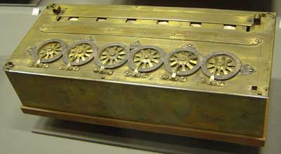 
         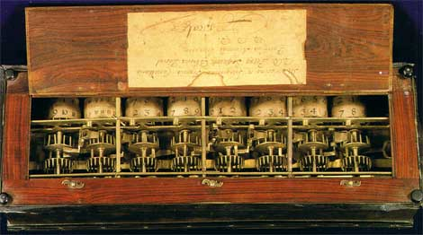</td>
  </tr>
  <tr>
     <td align="center">Máquina de Schickard (1623)</td>
     <td align="center">Calculadora de Pascal (1650)</td>
  </tr>
</table>

Además de los aspectos prácticos derivados de la realización de
operaciones matemáticas, estas máquinas de calcular también
representaban un avance científico y tecnológico y generaban
curiosidad y expectación en ferias y exhibiciones. 

También en esta época se hicieron muy populares mecanismos automáticos
que replicaban el movimiento de animales y personas. Eran los famosos
**autómatas**, realizados al igual que las máquinas de calcular con
engranajes, palancas, muelles y otros elementos de relojería.

#### Charles Babbage y Ada Lovelace

En el siglo XIX la invención del motor de vapor y la automatización de
los procesos de fabricación con mecanismos cada vez más complejos da
lugar a la revolución industrial. 

Un ejemplo es la industria textil, con la invención del telar mecánico
en 1805 por el ingeniero francés Joseph Marie Jacquar. Este telar
funcionaba de forma completamente automática, sin necesidad de
operadores humanos. Podía producir cualquier tipo de patrón, según
la programación proporcionada por cintas perforadas. Se trata de uno
de los primeros mecanismos programables.

En la fotografía de la derecha se puede ver una imagen de las cintas
perforadas que programaban los patrones de estos telares de Jacquar.

##### Motor de diferencias

En 1820 el ingeniero inglés Charles Babbage diseñó el motor de
diferencias (*Babbage difference engine*) para poder calcular e
imprimir tablas numéricas de logaritmos utilizando el
[método de las diferencias](http://acarol.woz.org/difference_engine.html#HowDoesDifferenceEngine)
para calcular valores de un polinomio.

Utilizaba un sistema de numeración decimal y consistía en más de 8.000
piezas que se movían con una palanca giratoria. Babbage trabajó
durante varios años en la máquina sin poder completarla. En 2002 el
*Science Museum* de Londres presentó una reconstrucción totalmente
funcional ([ver vídeo](http://www.youtube.com/watch?v=0anIyVGeWOI)).

##### Motor analítico 

Todas las máquinas de calcular construidas hasta este momento eran
manuales, un operador debía introducir las operaciones una a una. El
motor de diferencias es automático (funciona haciendo girar una
palanca) pero estaba diseñada para realizar un único cálculo.

En 1840 Babbage tiene la idea de lo que podría haber sido la primera
máquina calculadora automática programable: el *motor analítico*. Una
de las fuentes en las que se inspiró fue el telar de Jacquard. Si los
patrones definidos en una cinta perforada podían dirigir un telar para
que tejiese un determinado dibujo, ¿no podría diseñarse una máquina
que en lugar de tejer realizará cálculos? La máquina ya no estaría
limitada a realizar un único cálculo, sino que se podrían modificar
las operaciones a realizar mediante la cinta perforada.

De esta forma, la idea del motor de diferencias quedó superada por una
máquina de propósito general, que sería capaz de realizar cualquier
cálculo programado en la cinta.

Se trataría de una máquina totalmente mecánica, pero muchísimo más
compleja. Babbage diseñó tres tipos de cintas (o tarjetas) perforadas:
una para definir las operaciones matemáticas, otra para las constantes
numéricas y otras para las operaciones de carga y almacenamiento de
operaciones y números en la "memoria" de la máquina. La máquina tenía
tres lectores separados para cada una de las cintas perforadas.

La máquina estaba diseñada para trabajar en base 10 y se podía
conseguir que sus cálculos realizaran saltos condicionales y bucles.

Babbage trabajó durante más de 30 años para intentar construir la
máquina. Tenían una enorme complejidad para la época y necesitaba
muchísima financiación. En 1871 murió habiendo podido construir sólo
una parte.

<table>
  <tr>
     <td>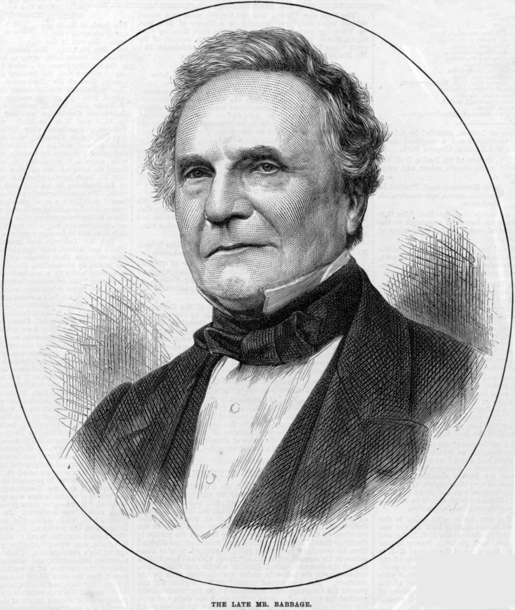</td>
     <td>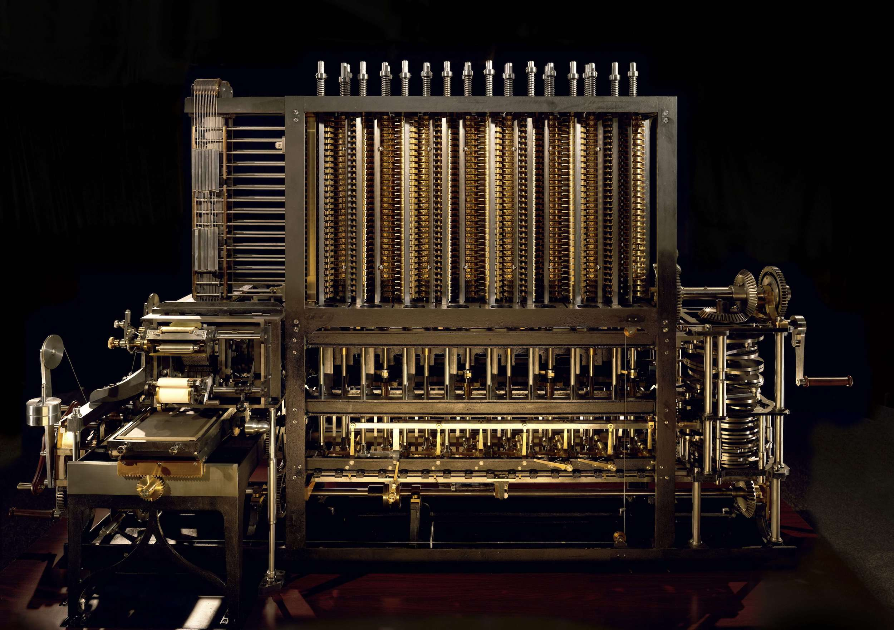</td>
     <td>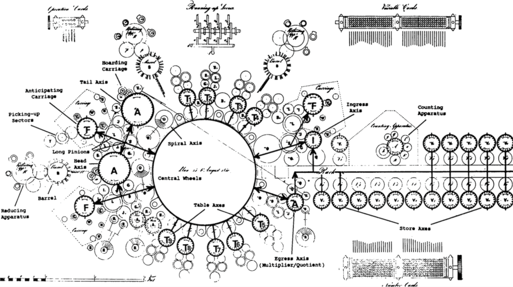</td>
  </tr>
  <tr>
     <td align="center">Charles Babbage</td>
     <td align="center">Motor de diferencias</td>
     <td align="center">Motor analítico</td>
  </tr>
</table>

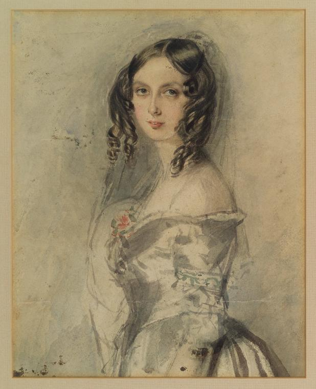

**Ada Lovelace** tuvo un papel fundamental en la divulgación de la
máquina, de sus sistema de programación y fue la primera que entendió
sus posibilidades más allá del cálculo de fórmulas. 

De forma poco habitual para la época, Ada fue educada en el campo de
las ciencias y de las matemáticas. A principios de 1840, con
veinticico años, conoció el trabajo de Babbage y colaboró con él,
dedicándose durante varios años a conocer y estudiar el diseño y el
funcionamiento del motor analítico. 

En 1843 publicó el trabajo _"Sketch of the analytical engine invented
by Charles Babbage"_ en el que traduce del italiano un artículo sobre
el motor analítico escrito por el científico Luigi Federico Menabrea
y, lo más importante, añade reflexiones propias sobre el alcance del
invento y construye un ejemplo completo, con tablas y diagramas, de
cómo hacer que la máquina produzca la secuencia de los números de
Bernoulli.

Se puede considerar estas tablas y diagramas como el _primer programa
de un computador_. Pero hay que entender que no se trata de un
programa escrito en un lenguaje de programación (el motor analítico no
tenía un conjunto de instrucciones definido, ni las ejecutaba de forma
secuencial, como los procesadores que veremos más adelante) y que el
computador se trataba de un computador mecánico que no llegó a
construirse.

Puedes encontrar más información sobre Ada Lovelace en el siguiente
enlace
[Ada Lovelace, la primera programadora de la historia](https://www.genbetadev.com/desarrolladores/ada-lovelace-la-primera-programadora-de-la-historia). Un
artículo mucho más profundo y detallado es el de Stephen Wolfram: [Untangling the Tale of Ada Lovelace](http://blog.stephenwolfram.com/2015/12/untangling-the-tale-of-ada-lovelace/).

### <a name="2"/> 2. Avances previos a los primeros computadores

Todas las máquinas vistas hasta ahora representan avances en el proceso
del desarrollo de los primeros computadores, pero a finales del siglo
XIX todavía no existía la tecnología ni la teoría matemática necesaria
para construir un computador de propósito general. Son ideas de genios
inventores adelantados a su tiempo.

Se necesitan algunos avances adicionales antes de llegar a la década
clave en la historia de los computadores, la década 1940-50. Algunos
de estos avances son teóricos o matemáticos, otros tecnológicos y
otros integran tecnología y matemática. Vamos a verlos brevemente en
orden cronológico.

#### Álgebra de Boole (1850)

El matemático inglés George Boole publicó en 1847 el trabajo _"The
Mathematical Analysis of Logic"_, donde describe un sistema algebráico
de lógica basada en los valores Verdad y Falso (fácilmente
representables en binario como 0 y 1), los operadores AND, OR y
NOT y las tablas de verdad que describen el funcionamiento de esos
operadores.

El álgebra de Boole, tal y como se denominó el sistema, se hizo
popular en matemáticas y lógica y fue utilizado 80 años después por
Claude Shannon para formalizar el funcionamiento de los primeros
circuitos digitales diseñados en sus tesis de máster en el MIT.

#### Relés electromecánicos (1850)

Los relés electromecánicos son dispositivos que permiten implementar
interruptores, amplificadores de señal o puertas lógicas. 

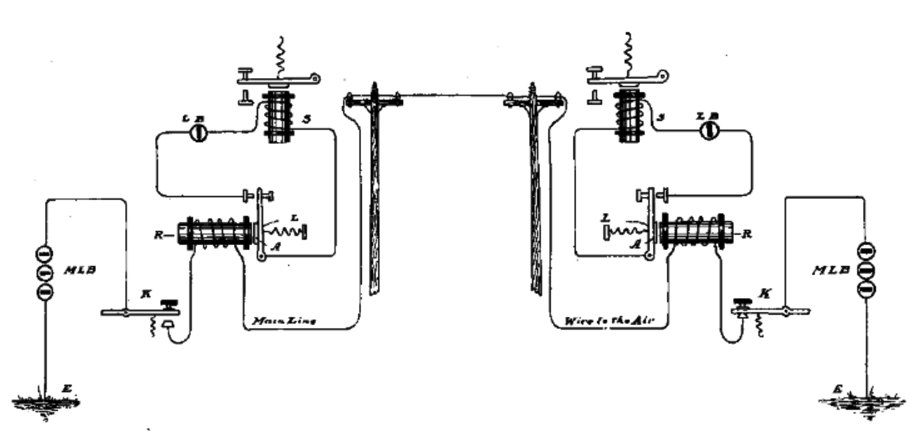

Son elementos que tienen una entrada de control que puede activar el
paso de corriente por un electroimán. Cuando el electroimán se activa
atrae a una pestaña y se cierra el circuito principal del relé, con lo
que la corriente pasa por él.

El funcionamiento del telégrafo está basado en este
mecanismo. Inicialmente todos los relés del sistema de transmisión
están abiertos y no pasa la corriente por ninguno. Cuando el
transmisor pulsa la palanca del telégrafo para generar un pulso, el
pulso se transmite por todos los relés cerrándose todos los circuitos
hasta el receptor. A la derecha podemos ver un esquema sacado de la
patente del telégrafo realizada por Morse en 1837.

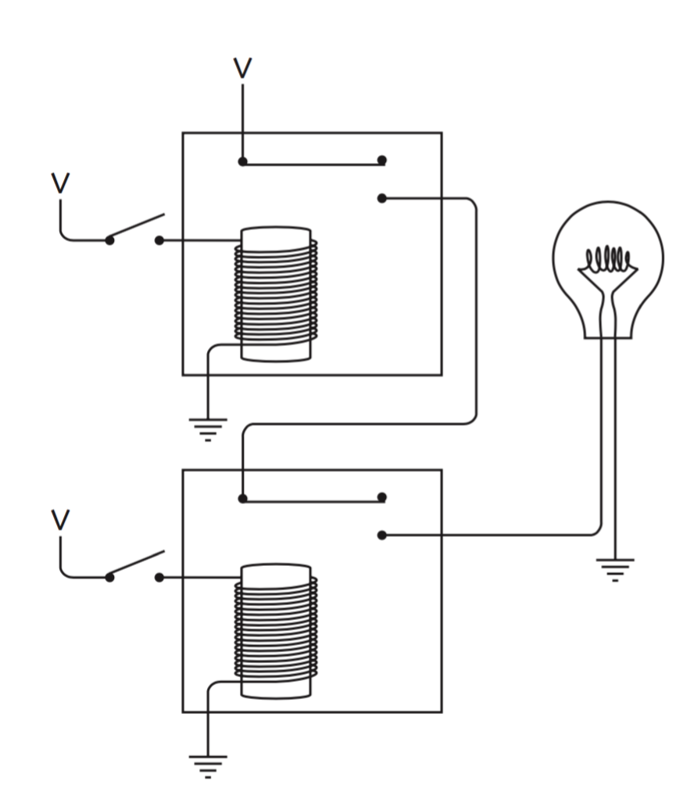

También podemos ver en la imagen de la derecha un ejemplo de una
puerta AND implementada con dos relés electromecánicos. Los dos relés
están dispuestos de forma secuencial. Cuando la corriente pasa por el
interruptor del primer relé se activa su electroimán y pasa la
corriente. Si en el interruptor del segundo relé también hay
corriente, se cierra también su circuito y la corriente pasa hasta la
bombilla. La bombilla se enciende cuando llega una señal de 1 a ambos
relés. Si alguno de los relés no tiene corriente en su interruptor (un
0) la bombilla entonces seguirá apagada. 

Los relés electromecánicos fueron la pieza básica sobre la que se
construyeron todos los primeros computadores. Después, en los años 40,
serían sustituidos por las válvulas de vacío (inventadas en 1910), que
permitían realizar el mismo comportamiento pero de una forma
totalmente electrónica. Y después, en los años 50, por los
transistores, mucho más pequeños, fiables y de menos consumo,
aumentando de forma exponencial su velocidad.

#### Codificación de la información con tarjetas perforadas (1890)

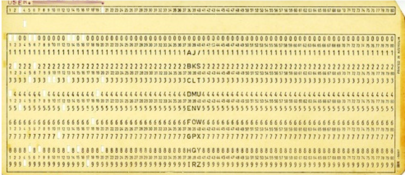

La forma de introducir los programas y los datos en muchos de los
primeros computadores era mediante tarjetas perforadas.

Tienen su origen en Herman Hollerith, que las inventó a finales del
siglo XIX para automatizar el procesamiento del censo en los Estados
Unidos

En su origen cada tarjeta guardaba los datos de una persona y usaban
una codificación *unaria*: se agujereaba el dato correspondiente
(letra o valor) a cada persona (su fecha de nacimiento, sexo, estado
civil, etc.)

Las tarjetas perforadas usadas en los primeros computadores ya
utilizan una codificación. Cada columna (o fila) define un carácter
utilizando alguna combinación de agujeros. Cada tarjeta perforada
representa una línea de texto.

Podemos probar un [simulador de tarjetas perforadas](http://www.kloth.net/services/cardpunch.php).

#### Circuitos lógicos implementados con relés (1930)

Claude Shannon, George Stibitz y otros ingenieros como el alemán
Konrad Zuse se dieron cuenta de forma independiente de que los relés
usados para los telégrafos podían utilizarse como puertas lógicas para
definir circuitos sumadores, multiplicadores, etc. de números en
binario. 

#### Máquina universal de Turing (1935)

La máquina de Turing no es un computador real, no existe
físicamente. Es un *modelo computacional* que formula Alan Turing para
estudiar matemáticamente cuáles son los límites del cálculo y la
computación, si existen problemas que no pueden ser calculados por muy
potente que sea el computador.

Alan Turing, en la Universidad de Cambridge, publicó en 1935 su
trabajo "On Computable Numbers, with an Application to the
Entscheidungsproblem" en el que demuestra que su nuevo modelo
computacional es equivalente a cualquier modelo computacional
planteado y que existen problemas que no pueden resueltos por ninguna
computación. Este modelo computacional es muy sencillo y muy elegante,
con las características abstractas esenciales de un instrumento de
computación. La máquina de Turing es muy similar a un computador
físico, pero contiene elementos ideales y poco eficientes que hacen
imposible tomarlo como un diseño de a partir del que construir un
computador físico.

Una máquina de Turing consiste en un scanner lee y escribe 0s y 1s de
una cinta infinita (memoria) y se mueve y los escribe en función de
una tabla definida en la máquina (programa).

En el mismo trabajo Turing define el concepto de *máquina universal*
que es capaz de leer de la cinta un programa cualquiera y simular su
comportamiento en otra parte de la cinta. Esta idea tuvo un profundo
impacto en el desarrollo de los computadores, porque mostraba que es
posible escribir programas que tomen como datos otros programas. Esto
abre la puerta a la idea de los programas almacenados en memoria (ya
que son otros datos más) y a la creación de compiladores e intérpretes.

Se dice que un lenguaje de programación es **Turing-completo** cuando
es posible escribir en él un programa que simule una máquina de
Turing. De esta forma se puede afirmar que es capaz de escribirse en
él cualquier algoritmo computable. En concreto se ha demostrado que
para que un conjunto de instrucciones de un procesador sea
Turing-completo debe ser capaz de realizar saltos condicionales y
direccionamiento indirecto. 

### <a name="3"/> 3. La década 1940-50

En la década 1940-50 se cristalizan todas las ideas previas y se
produce un avance exponencial en el desarrollo de máquinas de
computación, cada vez más rápidas y programables. La década termina
con los primeros computadores comerciales de propósito general y con
los primeros programas de inteligencia artificial (juegos de damas y
ajedrez).

#### 1941: la máquina de calcular Z3 de Zuse

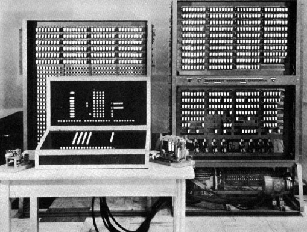

De forma independiente a todos los proyectos que veremos a
continuación, el ingeniero alemán Konrad Zuse diseñó y construyó entre
1938 y 1941 la máquina de calcular Z3. Se considera uno de los
primeros computadores programables. Era una máquina electromecánica,
que utilizaba 2.300 relés para construir principalmente una unidad
aritmética que operaba sobre dígitos binarios de 22 bits.

La máquina Z3 sólo podía ejecutar secuencias fijas de operaciones
aritméticas en punto flotante (suma, resta, multiplicación, división y
raíz cuadrada) codificadas en una cinta perforada. El programa se
codificaba en una cinta externa y se leía paso a paso de forma
mecánica. En sus instrucciones no existía el salto condicional, por lo
que la máquina no puede considerarse un computador de propósito
general, al no ser Turing-computable.

Debido a que los finales de la cinta perforada podían pegarse, la
máquina Z3 era capaz de ejecutar de forma repetida un bucle sencillo
de operaciones aritméticas que actuaban sobre números almacenados en
memoria.

La arquitectura de la Z3 es el siguiente:

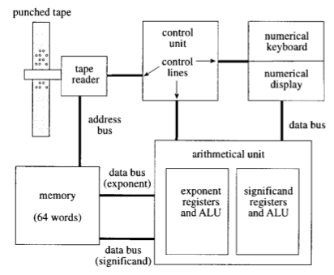

- Contiene registros de memoria denotados por letras (no se puede
  acceder de forma indirecta)
- La instrucción LOAD <registro> carga el contenido del registro (un
  número en punto flotante) como un operando de una operación
  matemática
- La instrucción STORE <registro> guarda el resultado de la operación
  en un registro

Un ejemplo de programa:

    LOAD b
    LOAD c
    op
    STORE a

El programa de cálculos a realizar se escribía de forma secuencial en
una cinta perforada. La Z3 iba leyendo la cinta y realizando las
operaciones indicadas.

Debido al estallido de la Segunda Guerra Mundial el trabajo de Zuse
quedó olvidado y no tuvo repercusión fuera de sus fronteras.

##### Resumen de características

- _**Tecnología**_: Electromecánica, relés.
- _**Programación**_: Cinta con instrucciones codificadas. El conjunto
  de instrucciones no tiene saltos condicionales ni direccionamiento
  indirecto, por lo que no es Turing-computable.
- _**Memoria**_: 64 palabras de 22 bits en almacenadas en relés.
- _**Velocidad**_: 1 instrucción por segundo.

#### ABC (1942, USA)

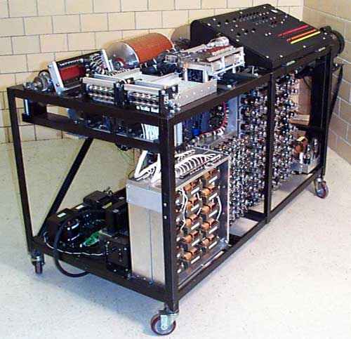

En paralelo al desarrollo del Z3, de forma independiente, el profesor
estadounidense John Vincent Atanasoff en la universidad de Iowa y su
estudiante de doctorado Cliff Berry diseñan y desarrollan el primer
computador totalmente electrónico, utilizando unas 300 válvulas de
vacío (**ABC**, *Atanasoff-Berry Computer*).

Realmente no se trataba de un computador genérico, sino de una máquina
de cálculo de propósito específico orientada a la resolución de
sistemas lineales de ecuaciones algebráicas.

Aunque la parte electrónica se terminó con éxito, el computador no
llegó nunca a funcionar totalmente. Las partes mecánicas, como el
lector de tarjetas binarias, introdujeron continuamente errores
irrecuperables.

##### Resumen de características

- _**Tecnología**_: Electrónica, válvulas de vacío.
- _**Programación**_: No es de propósito general, la entrada de datos y ecuaciones se hace con tarjetas perforadas.
- _**Memoria**_: 60 números en representados en binario en palabras de 50 bits almacenadas en condensadores.
- _**Velocidad**_: 30 sumas/restas por segundo.

#### Colossus (1944, UK)

Colossus es el primer computador electrónico digital capaz de
funcionar de forma continua. Se desarrolló en el centro de
investigación británico de Bletchley Park en para automatizar la
descodificación de los mensajes alemanes durante la Segunda Guerra
Mundial.

En Bletchley Park también trabajó Turing desde 1938, diseñando y
construyendo una máquina electromecánica (la *Turing–Welchman bombe*)
que aceleró la descodificación de los mensajes producidos por las
máquinas codificadoras alemanas llamadas *Enigma*.

Colossus fue diseñado y construido entre 1943 y 1944 por el matemático
Max Newman y el ingeniero Tommy Flowers. Flowers convirtió un diseño
inicial electromecánico de Newman en un computador totalmente digital
electrónico utilizando válvulas de vacío. Colossus I tenía
aproximadamente 1600 válvulas de vacío. Las siguientes versiones
llegaron a tener 2400. En enero de 1943 se terminó Colossus I. Al
final de la guerra, en 1945, había diez versiones más avanzadas
funcionando diariamente en Bletchley Park.

Colossus tampoco fue un computador general. Aunque sus circuitos de
válvulas podían realizar operaciones booleanas y contar, no estaba
diseñado para realizar un programa (ni siquiera externo, como el
Z3). Estaba diseñado para la tarea específica de descodificación de
los mensajes usando un método predeterminado. Los operadores podían
modificar parámetros del método genérico de descodificación alterando
el cableado físico de la máquina, mediante enchufes e interruptores.

Todos estos trabajos fueron declarados secretos por el gobierno inglés
hasta 1983, cuando se autorizó a Flowers a publicar detalles parciales
del Colossus I. Durante muchos años no se supo que la computación
electrónica fue clave para descodificar los mensajes alemanes y ayudó
de forma decisiva al triunfo aliado en la Segunda Guerra Mundial.

##### Resumen de características

- _**Tecnología**_: Electrónica, válvulas de vacío.
- _**Programación**_: No es de propósito general, la entrada/salida se
  realiza con una cinta de datos perforada e interruptores.
- _**Memoria***_: No tiene elementos de memoria.

#### Mark-1 (1944, USA)

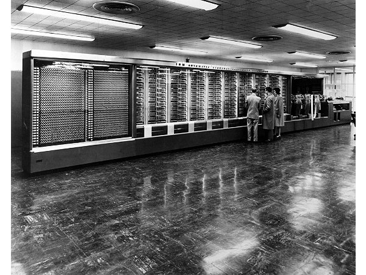

Mark-1 fue diseñada por el profesor Howard Aiken de Harvard y
construida por IBM. Era una máquina enorme, del tamaño de una
habitación, formada por miles de piezas conectadas a un árbol de levas
de más de 15 metros. El objetivo del Mark-1 era el cálculo de tablas
resultantes de funciones matemáticas. Por ejemplo, tablas balísticas
para el lanzamiento de misiles.

##### Resumen de características

- _**Tecnología**_: Electromecánica, relés.
- _**Programación**_: Programa codificado en una cinta, similar al Z3,
sin operador de comparación, entrada de datos con 60 conjuntos de 24
interruptores.
- _**Memoria**_: 72 números en codificación decimal de 23 dígitos.
- _**Velocidad**_: 3 sumas/restas por segundo, una división tardaba 15
  segundos y un logaritmo o función trigonométrica alrededor de 1
  minuto.

#### ENIAC (1945, USA)

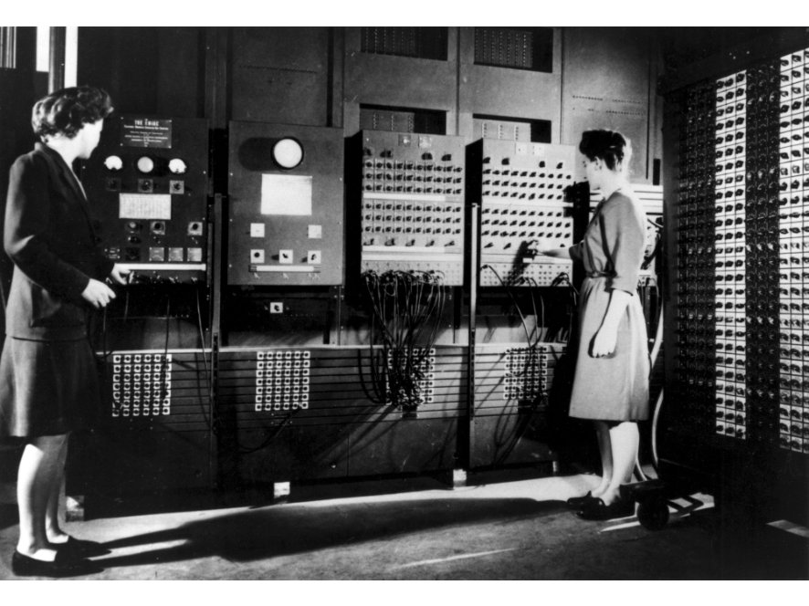

ENIAC es el primer computador electrónico construido en los EEUU, en
la Moore School de la universidad de Pensilvania, en un proyecto
financiado por el departamento de defensa y dirigido por J. Presper
Eckert y John Mauchly.

ENIAC tenía una tecnología similar a Colossus, pero era
considerablemente más grande y más flexible (aunque aun estaba lejos
de ser un computador de propósito general). La función principal de
ENIAC fue el cálculo de tablas numéricas usadas para el cálculo de
posición en los lanzamientos balísticos de misiles.

ENIAC no tenía tampoco un programa almacenado y para modificar su
funcionamiento era necesario reconfigurar la máquina usando enchufes e
interruptores. Durante muchos años se creyó que ENIAC fue el primer
computador electrónico en funcionamiento, por el secreto que rodeó la
fabricación de Colossus.

En 1944 John von Neumann se unió al grupo de desarrollo del ENIAC y
aconsejó modificaciones en la arquitectura que llevaron, en 1948, a
introducir un mecanismo primitivo de programa almacenado en memoria.

En los diseños iniciales del ENIAC se utilizaba una cinta de
instrucciones similar a la del Z3. Eckert parece que también se dio
cuenta de forma independiente, antes de la llegada de von Neumann, de
que la lectura de instrucciones de forma mecánica era el cuello de
botella de la máquina. La forma de sacar todo el partido a la
velocidad a la que los datos se procesaban por los circuitos
electrónicos era colocar las instrucciones codificadas en los mismos
dispositivos de alta velocidad que almacenaban las instrucciones.

##### Resumen de características

- _**Tecnología**_: Electrónica, 17.000 válvulas de vacío.
- _**Programa**_: podía realizar bucles, condicionales o subrutinas, pero 
el programa se introducía modificando sus interruptores y clavijas. 
La entrada y salida de datos se realizaba con tarjetas perforadas  
- _**Memoria**_: 20 registros decimales.
- _**Velocidad**_: 5.000 sumas/restas por segundo.

#### La arquitectura von Neumann

En 1945, mientras que el ENIAC estaba todavía en construcción, von
Neumann, trabajando en la Universidad de Princeton (EEUU) escribió su
famoso informe *First Draft of a Report on the EDVAC* en el que
propone la arquitectura básica de un computador digital de propósito
general con programas almacenados en memoria (*stored-program
electronic computer*) que denominó EDVAC.

Von Neumann se había interesado en el concepto de máquina universal de
Turing en los años 36-38, cuando coincidió con Turing en la
Universidad de Princeton. En la Moore School, von Neumann resaltó la
importancia del concepto de programa almacenado para la computación
electrónica, incluyendo la posibilidad de permitir que la máquina
modificara su propio programa cuando estaba en ejecución (por ejemplo,
para controlar los bucles y los condicionales).

Von Neumann trabajó desde 1945 hasta 1950 en la construcción de un
computador con esa arquitectura en el Instituto for Advanced Study en
Princeton.

El EDVAC se completó seis años después, pero no por sus diseñadores,
que dejaron la Moore School para construir computadores en otras
empresas.

En 1946 se celebraron en la Moore School conferencias y seminarios
sobre el EDVAC y su arquitectura. Asistieron un gran número de
investigadores americanos e ingleses. Las conferencias terminaron de
impulsar en universidades y centros de investigación de empresas el
concepto de arquitectura de computador basado en programas almacenados
en memoria.

El concepto de programa almacenado en memoria es clave en la historia
de los lenguajes de programación. Desde el momento en que un programa
se puede almacenar en memoria, se puede tratar de la misma forma que
se tratan otros datos. Aparecen los preprocesadores, lincadores,
compiladores e intérpretes. Programas que procesan otros programas.

#### Máquina de Manchester (1948, UK)

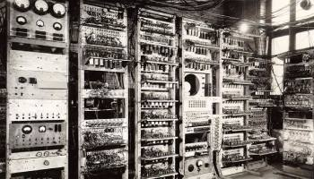

Una vez terminada la guerra, después de trabajar en el diseño de
Colossus, Max Newmann crea el *Computing Machine Laboratory* en la
universidad de Manchester.

El primer computador electrónico digital de propósito digital con
programa almacenado se construyó en este laboratorio. Se conoció con
el nombre de *Manchester 'Baby'*. Fue diseñado por Max Newmann usando
la tecnología proporcionada por los ingenieros F.C. Williams y Tom
Kilburn. Williams había inventado un dispositivo de memoria
electrónico (la *válvula de Williams*) capaz de sustituir las lentas
líneas de retardo de mercurio.

Max Newmann fue otra de las figuras claves en la divulgación de las
ideas fundamentales de los computadores y de la arquitectura basada en
un programa almacenado y un conjunto de instrucciones capaz de saltos,
condicionales y direccionamientos indirectos.

En una charla en la Royal Society el 4 marzo de 1948 explicaba estos
conceptos de la siguiente manera:

>The machines now being made in America and in this country are in
>certain general respects all similar. There is provision for storing
>numbers, say in the scale of 2, so that each number appears as a row
>of, say, forty 0's and 1's in certain places or "houses" in the
>machine.

>Certain of these numbers, or "words" are read, one after another, as
>orders. In one possible type of machine an order consists of four
>numbers, for example 11, 13, 27, 4. The number 4 signifies "add", and
>when control shifts to this word the "houses" H11 and H13 will be
>connected to the adder as inputs, and H27 as output. The numbers
>stored in H11 and H13 pass through the adder, are added, and the sum
>is passed on to H27. The control then shifts to the next order.

>In most real machines the process just described would be done by
>three separate orders, the first bringing [H11] (=content of H11) to
>a central accumulator, the second adding [H13] into the accumulator,
>and the third sending the result to H27; thus only one address would
>be required in each order.

>A machine with storage, with this automatic-telephone-exchange
>arrangement and with the necessary adders, subtractors and so on, is,
>in a sense, already a universal machine.

La máquina de Manchester fue el primer computador con un conjunto de
instrucciones completo, capaz de realizar saltos, condicionales y
direccionamiento indirecto. La primera ejecución de un programa fue el
21 de junio de 1948. En esa fecha Alan Turing se incorporó a la
universidad de Manchester, como director del Laboratorio de
Computación. Tres años después, con un diseño ampliado en el que
también influyó Turing, una versión mucho mayor de la máquina se
convirtió en el primer computador disponible comercialmente, el
Ferranti Mark I. El primero se instaló en la universidad de Manchester
en febrero de 1951, un mes antes que el UNIVAC I fuera entregado al
Departamento de Censo de los EEUU. Se vendieron otras 10 máquinas a
Gran Bretaña, Canadá, Holanda e Italia.

El primer programa complejo de Inteligencia Artificial, un jugador de
damas escrito por Christopher Strachey, se ejecutó en el verano de
1952 en el Ferranti Mark I en el Laboratorio de Computación de
Manchester. Strachey escribió el programa animado por Turing y usando
el manual de programación del Ferranti que Turing acababa de
escribir. Turing participó también en el desarrollo de otros programas
de IA, como un jugador de ajedrez basado en heurísticas.

##### Resumen de características

- _**Tecnología**_: Válvulas de vacío.
- _**Programa**_: almacenado en memoria, leído con tarjetas
perforadas. Uno de los primeros ordenador de propósito general
Turing-computable en funcionamiento con programas almacenados en
memoria.
- _**Memoria**_: 32 palabras de 32 bits almacenadas en memorias de
  línea de retardo de mercurio.
- _**Velocidad**_: 10.000 operaciones por segundo

#### EDSAC (1949, UK)

El EDSAC fue otro de los primeros computadores en funcionamiento que
utilizó la arquitectura von Neumann con el programa almacenado en
memoria. Fue desarrollado por un equipo dirigido por Maurice
Wilkes. Wilkes había asistido tres años antes a los seminarios de la
Moore School en donde conoció los fundamentos de la arquitectura.

Para la programación del EDSAC, Wilkes estableció una biblioteca de
programas cortos llamados subrutinas almacenados en tarjetas
perforadas.

El diseño del EDSAC fue mucho más robusto que el de la Máquina de
Manchester y se convirtió de hecho el primer computador en el que se
desarrollaron programas largos. Por ejemplo, en 1951 se habían
desarrollado 87 subrutinas en las siguientes categorías: aritmética de
punto flotante, operaciones aritméticas sobre número complejos,
división, exponenciación, ecuaciones diferenciales, series de
potencias, logaritmos, lectura y escritura, bucles _repeat until_,
_while_ y _for_, vectores y matrices.

##### Resumen de características

- _**Tecnología**_: Válvulas de vacío.
- _**Programa**_: almacenado en memoria, leído con tarjetas
perforadas. Uno de los primeros ordenador de propósito general
Turing-computable en funcionamiento con programas almacenados en
memoria.
- _**Memoria**_: 1024 palabras de 18 bits almacenadas en memorias de
  línea de retardo de mercurio.
- _**Velocidad**_: 1.5 milisegundos las operaciones ordinarias y 6
  milisegundos las multiplicaciones

#### Otros hitos de la historia de los computadores

Puedes encontrar otros hitos de la historia del computador en la
[línea de tiempo de la historia del computador](http://www.computerhistory.org/timeline/?category=cmptr)
del *Computer History Museum*.

### <a name="4"/> 4. Características esenciales de un computador

A pesar de haberse desarrollado múltiples variantes de máquinas,
arquitecturas y modelos de computador, existen ciertos elementos
esenciales comunes a todos ellos.

#### Computador universal

Un computador se dice que es universal cuando su conjunto de
instrucciones permite realizar cualquier programa computable. De forma
teórica un computador es universal cuando es posible simular con él
una máquina de Turing.

Los primeros computadores tenían cierta flexibilidad, pero estaban muy
lejos de ser universales.

Un computador universal debe tener suficiente memoria accesible por
referencia, acceso indirecto, como mínimo un acumulador y ser capaz de
ejecutar el conjunto de instrucciones CLR (clear), INC (increment),
LOAD, STORE, and BZ (branch if zero) (Raul Rojas, Konrad Zuse's
Legacy).

De forma práctica, los computadores empezaron a dejar de ser máquinas
de calcular y empezaron a resolver otros tipos de problemas: problemas
combinatorios de búsqueda eficiente en un espacio de soluciones
(criptografía o problemas matemáticos) o primeras aplicaciones de
inteligencia artificial (juegos como las damas).

#### El direccionamiento indirecto

Un concepto fundamental de los conjuntos de instrucciones de los
procesadores es el de direccionamiento indirecto. 

Un ejemplo de su funcionamiento es el siguiente programa escrito en un
lenguaje ensamblador imaginario.

    LOAD C #28AF
    LOAD A [C]
    INC C
    LOAD B [C]

La primera instrucción carga en el registro B el número hexadecimal
`#28AF` que representa la dirección de memoria 10.415. La segunda
instrucción carga en el registro A el contenido de esa dirección de
memoria. La siguiente instrucción incrementa en 1 la dirección de
memoria que hemos guardado en C y después se carga en B el contenido
de esa nueva dirección. El resultado es que hemos guardado en los
registros A y B los contenidos de las direcciones de memoria 10.415 y
10.416.

El direccionamiento indirecto nos permite hacer cálculos sobre
direcciones de memoria y guardar después los contenidos de las
direcciones resultantes en registros. Esto es fundamental para que un
lenguaje de programación pueda tener saltos, llamadas a subrutinas o
estructuras de datos dinámicas.

De hecho, el matemático Raúl Rojas, experto en la historia de la
computación, establece en su artículo
([On Basic Concepts of Early Computers in Relation to Contemporary Computer Architectures](http://page.mi.fu-berlin.de/rojas/pub/on_basic_1994.pdf)
que el direccionamiento indirecto es necesario para que un conjunto de
instrucciones de un procesador sea Turing-completo.

### <a name="5"/> 5. Los primeros lenguajes de programación

Los primeros computadores electrónicos se programan directamente
usando el conjunto de instrucciones del procesador, en código máquina,
código hexadecimal

El primer lenguaje de un nivel algo más elevado que el código máquina
es el ensamblador. Programas que empiezan a ayudar a los
programadores: ensambladores. Hay una relación casi directa entre la
notación en ensamblador y el código hexadecimal que produce el
ensamblador.

A finales de la década de los 40 se empiezan a intentar resolver con
los primeros computadores los primeros problemas matemáticos distintos
de operaciones numéricas: codificación y descodificación, problemas
combinatorios como el coloreado del mapa o problemas de ordenación.

Uno de los primeros algoritmos de von Neumann realiza una ordenación
de un conjunto de números. Von Neumann lo describe en una carta
fechada en 1945. Utiliza el conjunto de instrucciones del EDSAC cuando
todavía no se había construido. El programa fue estudiado por Donald
Knuth en el artículo *Von Neumann's first Computer Program*, en donde
documenta que había un bug en las primeras instrucciones. Es el primer
bug escrito del que se tiene historia. Si Von Neumann hubiera podido
ejecutar el programa en el EDSAC se hubiera dado cuenta del error y
hubiera sido la primera depuración de un programa.

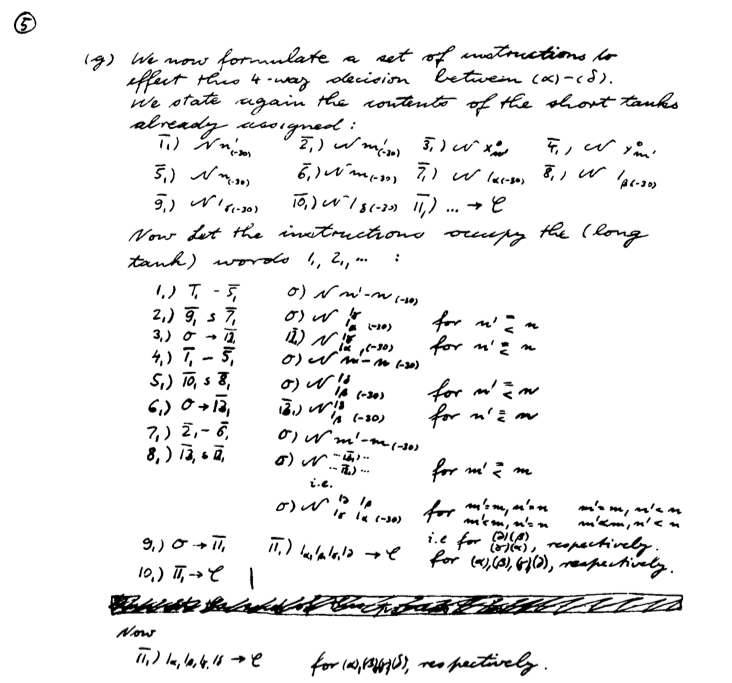

*Primer programa de Von Neumann*

(Donald Knuth, "Von Neumann's first Computer Program", Journal of the
ACM Computing Surveys (CSUR) Surveys, Volume 2 Issue 4, Dec. 1970,
Pages 247-260)

### <a name="6"/> 6. El nacimiento de los computadores comerciales

El [UNIVAC](http://en.wikipedia.org/wiki/UNIVAC_I) fue el primer
computador comercial (1951). Con este computadora aparece por primera
vez la figura del programador: manuales, cursos de formación, ofertas
de empleo, etc.

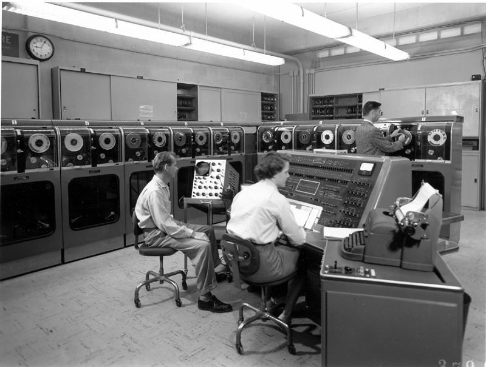

*UNIVAC*

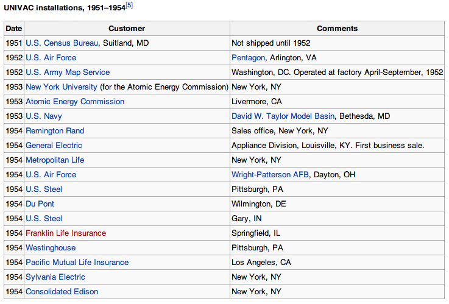

*Instalaciones comerciales del UNIVAC*

#### Manual de programación del UNIVAC (1959)

Los computadores son lentos y muy complicados de instalar y mantener.

Son más importantes las horas de funcionamiento del computador que las
horas de trabajo del programador.

La complejidad de las tareas a programar es pequeña y es suficiente
con los programas en ensamblador.

El
[manual de 1959 de programación del UNIVAC](http://www.bitsavers.org/pdf/univac/univac1/UNIVAC1_Programming_1959.pdf)
es una referencia histórica de gran interés de la que hemos extraído
las siguientes imágenes:

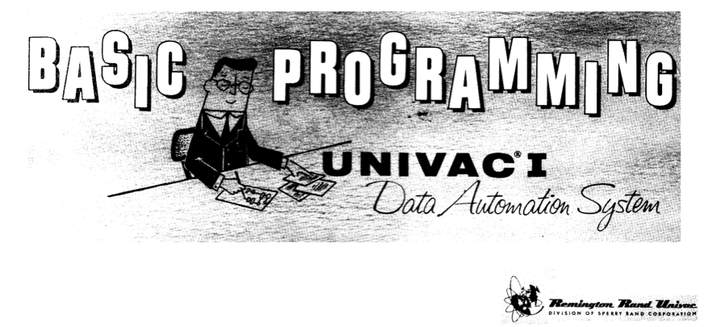

*Manual del UNIVAC*

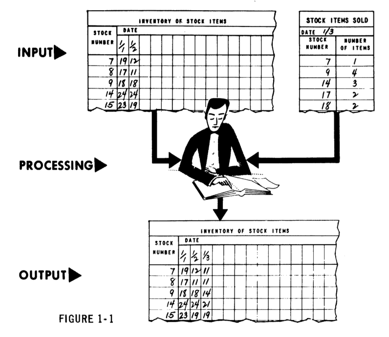
*Programación del UNIVAC*

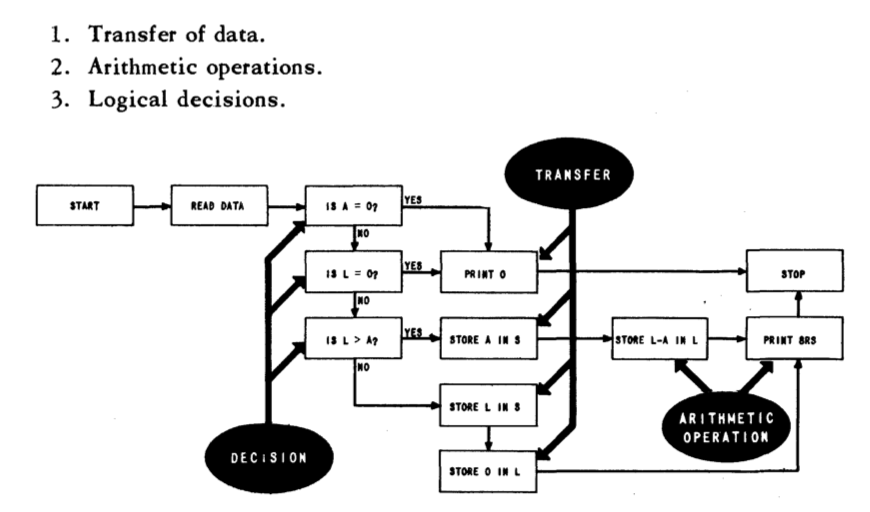
*Algoritmo UNIVAC*

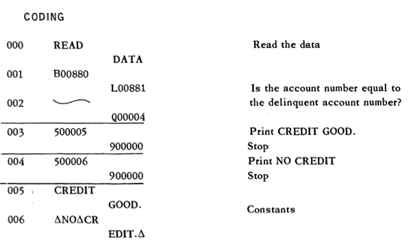
*Codigo UNIVAC*

Se realizan los primeros anuncios y reportajes de televisión sobre
computadores ([YouTube](https://www.youtube.com/watch?v=Pd63MHGQygQ))

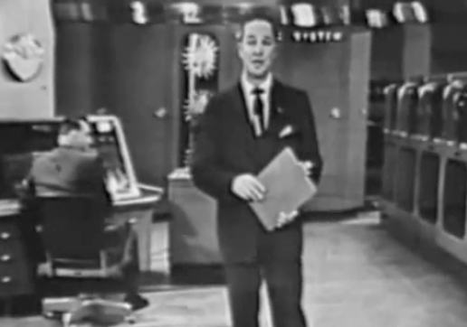

*Anuncio UNIVAC*

#### IBM 704

El [IBM 704](http://en.wikipedia.org/wiki/IBM_704) fue el otro gran
ordenador comercial de la década de los 50.

Tuvo una difusión mucho mayor que el UNIVAC: centros gubernamentales,
universidades.

Los primeros lenguajes de programación de alto nivel se desarrollan
para este computador.

*Foto IBM 704*

#### Programando los primeros computadores

> The UNIVAC I was an interesting machine to program, with its mercury
> delay line storage and its short mean time to failure. Programs were
> entered into the computer by typing them onto steel magnetic tape, a
> major innovation at that time.

> Working with the IBM 704 at NYU was an entirely different experience
> from the UNIVAC I. It was built for executing scientific
> applications, and had as its major innovation a magnetic core
> memory, replacing the Williams tube memory of the IBM 701 and the
> primary memory drum of the IBM 650. It also had a floating point
> arithmetic unit and index registers to form effective addresses,
> both of which were significant advances at that time. The machine
> had the equivalent of 128 KB primary memory, 32 KB of secondary drum
> memory and magnetic tapes that held 5 MB of data. It operated at
> 0.04 MIPS, and cost $3 million dollars in 1957, the equivalent of
> perhaps $20 million today.

> George Sadowsky,
> [My Second Computer was a UNIVAC I](http://www.georgesadowsky.com/papers/Univac-I.pdf)

### <a name="7"/> 7. Los primeros lenguajes de alto nivel

Los primeros lenguajes de alto nivel se desarrollaron a finales de la
década de los 50:

- FORTRAN en 1956
- Lisp en 1958

Ambos lenguajes planteaban dos enfoques muy distintos desde el
principio:

- FORTRAN
	- Primer lenguaje comercial, equipo de IBM dirigido por John
      W. Backus
	- Lenguaje imperativo: estado, estructuras de control, contador de
      programa, celdas de memoria
	- Lenguaje compilado
- Lisp
	- Lenguaje diseñado en un departamento de investigación, un equipo
      del MIT dirigido por John McCarthy
	- Lenguaje funcional: funciones, recursión, listas, símbolos
	- Lenguaje interpretado

#### FORTRAN

Desarrollado por IBM para programar el IBM 704. Algunos datos:

- Su nombre proviene de *FORmula TRANslating system*.
- El primer manual de FORTRAN se imprime en octubre de 1956 para el IBM 704.
- El primer compilador se comercializa en abril de 1956.

Cita de John Backus ([Wikipedia sobre FORTRAN](http://en.wikipedia.org/wiki/Fortran)):

> Much of my work has come from being lazy. I didn't like writing
> programs, and so, when I was working on the IBM 701, writing
> programs for computing missile trajectories, I started work on a
> programming system to make it easier to write programs.

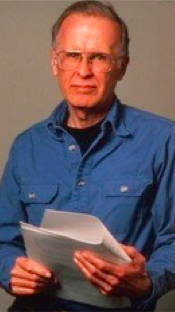

*John Backus*

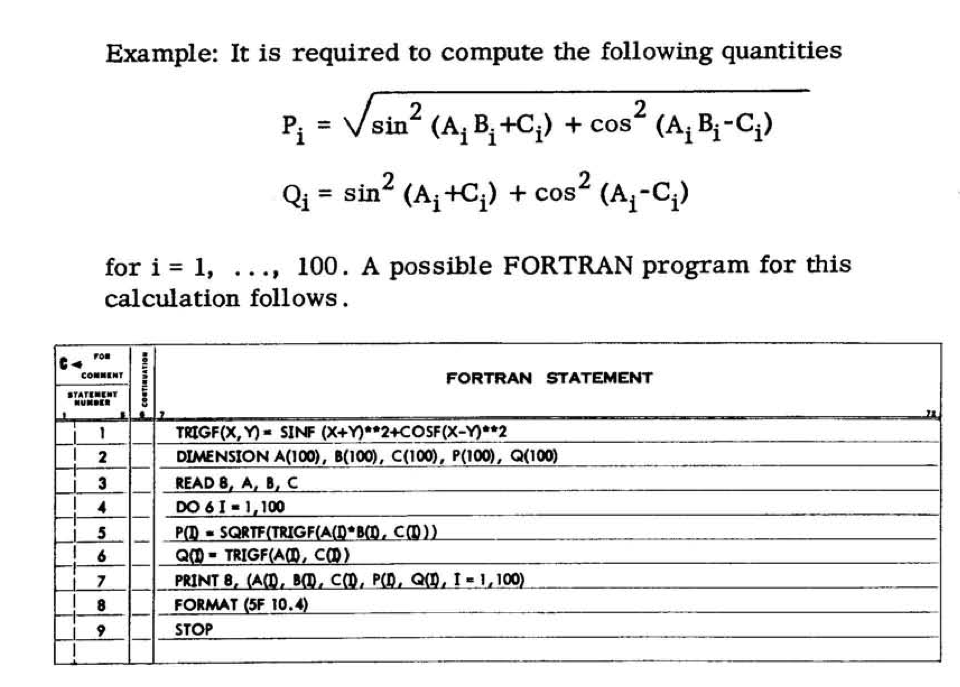

*Ejemplo FORTRAN*

Tomado del
[manual de FORTRAN del IBM 704](http://archive.computerhistory.org/resources/text/Fortran/102665486.05.01.acc.pdf)

#### Lisp

El otro lenguaje de alto nivel desarrollado en esa época es el
Lisp. Desarrollado a finales de los 50 en el MIT por John McCarthy.

Aunque históricamente el nombre del lenguaje se solía escribir con
letras mayúsculas (LISP), posteriormente se ha popularizado el uso de
la mayúscula sólo para la primera letra (Lisp). Esta forma es más fiel
al origen del nombre del lenguaje. *Lisp* no es un acrónimo, sino la
contracción de la expresión *List Processing*. El procesamiento de
listas es una de las características principales del Lisp.

McCarthy explica en un artículo de 1979 la historia inicial del Lisp:

> [...] My desire for an algebraic list processing language for
> artificial intelligence work on the IBM 704 computer arose in the
> summer of 1956 during the Dartmouth Summer Research Project on
> Artificial Intelligence which was the first organized study of
> AI. [...]

> [...] There were two motivations for developing a language for the
> IBM 704. First, IBM was generously establishing a New England
> Computation Center at M.I.T. which Dartmouth would use. Second, IBM
> was undertaking to develop a program for proving theorems in plane
> geometry (based on an idea of Marvin Minsky's), and I was to serve
> as a consultant to that project. At the time, IBM looked like a good
> bet to pursue artificial intelligence research vigorously, and
> further projects were expected. It was not then clear whether IBM's
> FORTRAN project would lead to a language within which list
> processing could conveniently be carried out or whether a new
> language would be required.[...]

> [...] I invented conditional expressions in connection with a set of
> chess legal move routines I wrote in FORTRAN for the IBM 704 at
> M.I.T. during 1957-58. This program did not use list processing. The
> IF statement provided in FORTRAN 1 and FORTRAN 2 was very awkward to
> use, and it was natural to invent a function XIF(M,N1,N2) whose
> value was N1 or N2 according to whether the expression M was zero or
> not. The function shortened many programs and made them easier to
> understand, but it had to be used sparingly, because all three
> arguments had to be evaluated before XIF was entered, since XIF was
> called as an ordinary FORTRAN function though written in machine
> language. This led to the invention of the true conditional
> expression which evaluates only one of N1 and N2 according to
> whether M is true or false and to a desire for a programming
> language that would allow its use.[...]

> John McCarthy, [History of LISP]

[History of LISP]: http://www-formal.stanford.edu/jmc/history/lisp/lisp.html

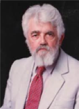

*John McCarthy*

Uno de los primeros manuales de Lisp publicados es el
[manual de LISP](http://bitsavers.org/pdf/mit/rle_lisp/LISP_I_Programmers_Manual_Mar60.pdf)
de 1960 para el IBM 704 escrito por Phyllis A. Fox. del grupo de
investigación del MIT dirigido por McCarthy.

Un ejemplo de código Lisp:

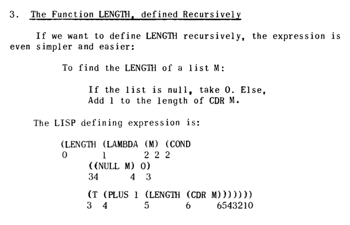

*Ejemplo LISP*

Tomado de
"[The Programming Language LISP](http://www.softwarepreservation.org/projects/LISP/lisp15_family#Berkeley_and_Bobrow_)",
MIT Press, 1964

## <a name="10"/> 10. Bibliografía

- Raul Rojas, "Konrad Zuse's legacy the architecture of the Z1 and
  Z3", IEEE Annals of the History of Computing, Vol. 19, No. 2, 1997
- Charles Petzold, "Code", Microsoft Press, 2000 (Capítulo 18: "From
  Abaci to Chips")
- Jack Copeland, "The Modern History of Computing", The Stanford
  Encyclopedia of Philosophy (Fall 2008 Edition), URL =
  <http://plato.stanford.edu/archives/fall2008/entries/computing-history/>
- Georgi Dalakov, "History of Computers", URL =
  <http://history-computer.com>

----

© 2018 Domingo Gallardo
